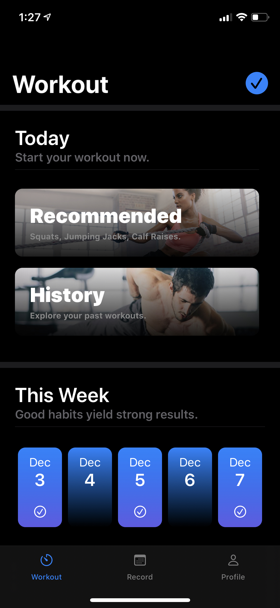
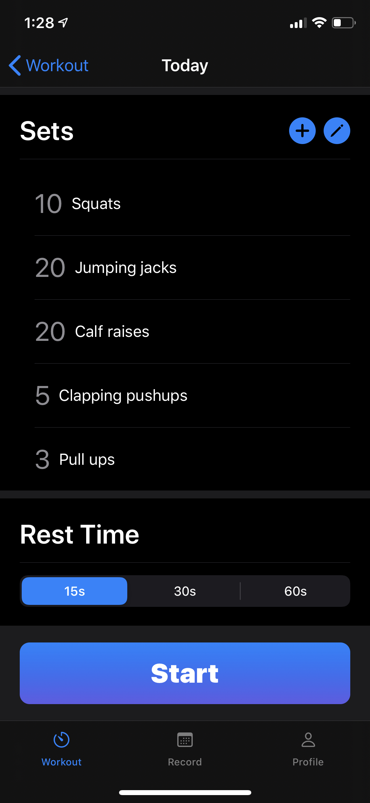
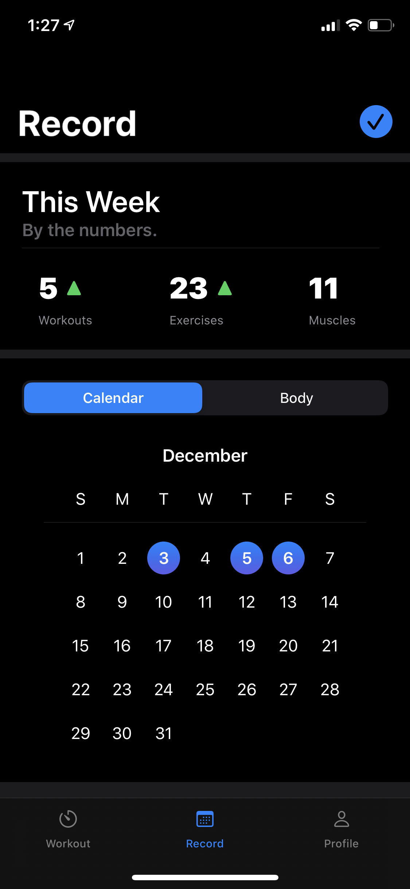
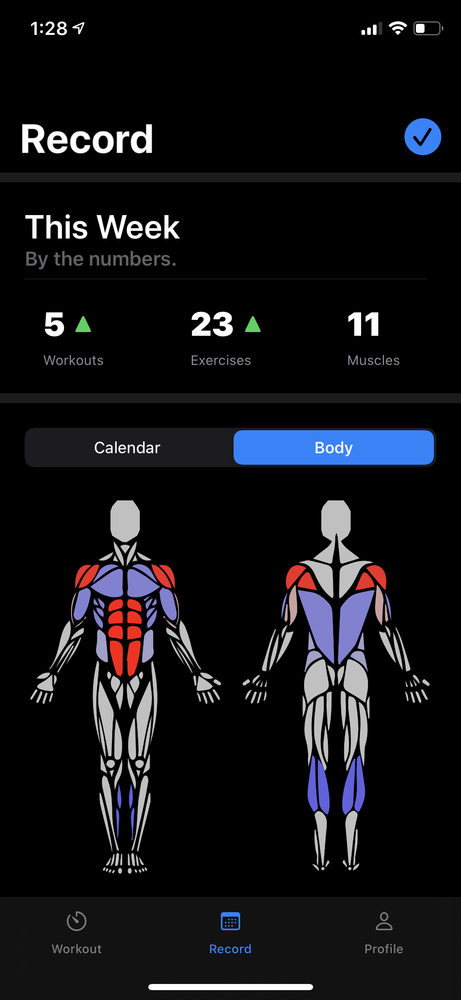
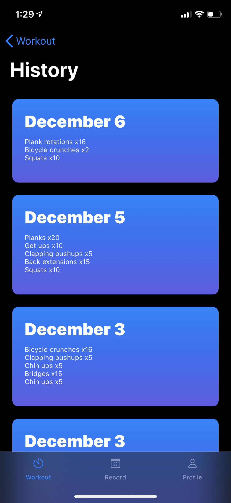

# Fitnetic
Supercharge your 7-Minute Workout with Fitnetic, a data-driven application that leverages Augmented Reality and Machine Learning to improve your home gym experience.

Developed by Calvin Lui, Christina Chou, and Wilson Yu for 67-442 iOS Engineering at Carnegie Mellon University.

## Screenshots
| Home | Workout | Squats |
| :----: | :----: | :----: |
|  |  |  |

| Calendar | Body Map | History |
| :----: | :----: | :----: |
|  |  |  |

## Features
- Recommended workout based on past workouts
- Use past workouts to begin a workout
- Add, reorder, and remove sets for a workout
- Adjustable rest timer that activates between sets
- Automated rep counting and form checking on select workouts
- Audio feedback on each rep and pace of set (time/rep)
- Workout record with statistics, calendar, and body map
- Support for light and dark mode

## Dependencies
This app was developed with the help of the open source community. Special thanks to the developers of:
- [PoseEstimation](https://github.com/tucan9389/PoseEstimation-CoreML)
- [SVGKit](https://github.com/SVGKit/SVGKit)

## Requirements
- Xcode 11+
- iOS 13+

**NOTE:** These requirements exist because Fitnetic was built with SwiftUI.

## For Graders
Currently, we support AR/ML on two exercises: squats and jumping jacks (*not working well yet*). To activate AR/ML mode, tap the camera button during your workout. We recommend that you place your phone on the floor leaning against the wall, at an angle where your entire body is visible to the camera. The app will provide audio feedback.

**NOTE**: Your arms must be extended or touching your head while doing squats (see GIF). This is part of our form checking, and improper reps will not be counted.

This project uses SVGKit, which does not compile on simulators. So, to run the unit tests, a device must be plugged in and selected as the target.
